# 实验室半导体制冷温度控制

基于树莓派 4B + PT100/DHT2302 传感器 + 继电器 + 半导体制冷片（TEC）的实验室温度控制与温湿度监测系统。

## 1. 热电冷却器（TEC）

### 1.1 TEC 简介

一种基于珀耳帖效应的加热和冷却器件。由于具有无噪声、无振动、无制冷剂、小尺寸和重量轻等优点，TEC 广泛用作光学通信和医疗设备等工业领域的精密温度控制系统。

### 1.2 TEC 原理

TEC 的原理是珀耳帖效应。当电流通过由不同导体组成的电路时，每个导体的接头处会出现吸热和放热现象。

下图 1-1 是 TEC 原理图。在两侧施加电压时，电子通过铜传输到 P 型半导体、N 型半导体，然后返回到铜。由于电子发生能级转换，接头处会出现发热或冷却。当电流方向发生变化时，发热面和冷却面也会交换。吸收和释放的热量与电流强度成正比，而且与两个导体的性质和热端温度有关。

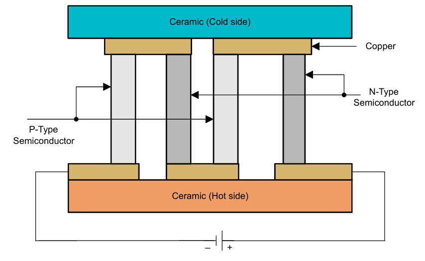

**图 1-1**

## 2. 实验所用器材

### 2.1 半导体制冷片

| 产品型号      | 尺寸          | 供电电压 | 最大电流 | 最大温差   |
|:--------------|:--------------|:---------|:---------|:-----------|
| TEC1-12706    | 40\*40\*3.7mm | DC12-15V | 6A       | Δ65 摄氏度 |
| TEC1-12706k10 | 30\*30\*2.8mm | DC12-15V | 6A       | Δ65 摄氏度 |
| TEC1-12710    | 40\*40\*3.7mm | DC12-15V | 10A      | Δ65 摄氏度 |

根据 TEC 原理，其**制冷效果、功率与电流成正向关系**。即电流越大，吸热、放热量越大。电压的影响较小。

### 2.2 供电电源

A. 工业级 12V、10A 开关电源。如图 2-2，经测试，最右侧输出电压调整旋钮可以在一定程度上调整电流、电压的大小。**实现过 5.5A-9A 的调整**。


**图 2-2**

B. 使用 KEITHLEY 2230G-30-3 作为电流源，**可实现电流在 0-3A 范围的微调**。

### 2.3 散热器

目前使用常规**四针脚 PWM 风冷散热器**。可不连信号针脚，直接连右侧两个正负电极使用。

若需要提高散热效率、减小体积，可以尝试使用水冷散热装置。

### 2.4 温度探测器

- A. 热电偶
- B. 三线 PT100 铂热电阻（配合 MAX31865 高精度的 RTD 至数字输出转换器使用）
- C. 连接树莓派的 DHT2302 温湿度传感器

### 2.5 树莓派 4B

### 2.6 其他配件

树莓派散热器，读卡器和内存卡，继电器等。

## 3. 树莓派初次配置

（8GB 卡，用户名 `****`，密码 `********`，外部设置一个 WIFI 热点，名称 `*****`，密码 `********`。敏感信息已隐藏，请按实际情况替换。）

### 3.1 树莓派 4B 系统刻录，SD 卡启动

A. 使用 imager 工具，将 SD 卡插入电脑，格式化，烧录树莓派 4B 操作系统。在**编辑设置**可设置 WiFi，这里可以用手机热点或者电脑热点（电脑热点可显示查询树莓派 IP），方便之后通过 SSH、VNC 连接。参考网站：<https://pidoc.cn/docs/computers/getting-started>

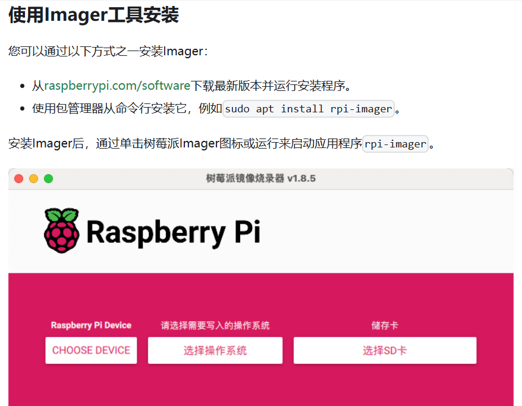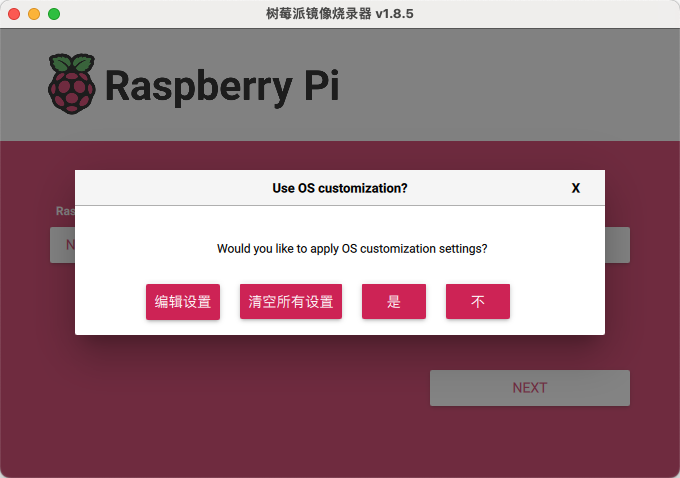

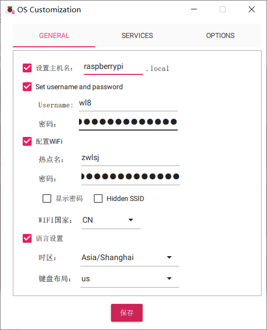

B. SD 卡插入树莓派，上电启动。（若有显示器、键盘、鼠标可先连树莓派，再上电启动。）以下使用 Putty 程序通过 SSH 连接树莓派，使用 VNC 在 Windows 电脑端远程显示桌面。

**SSH 连接：**

提前打开电脑热点，树莓派上电，等待开机初始化，连接 WiFi。顺利的话可在电脑端看见连接成功，并可查询其 IP。复制 IP，用 Putty 程序连接，输入用户名、密码可进入树莓派终端。

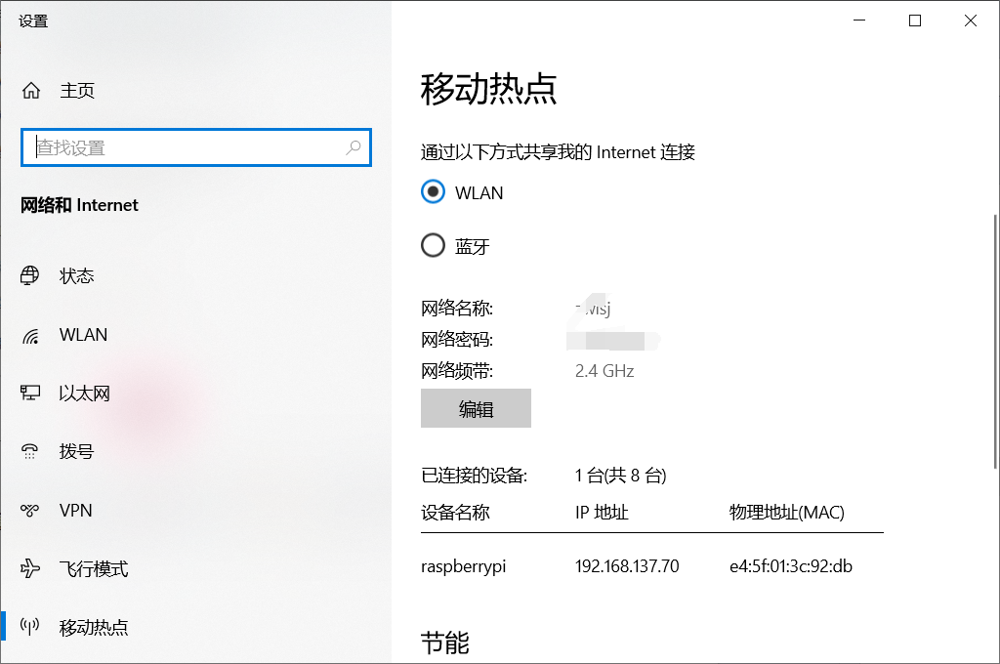

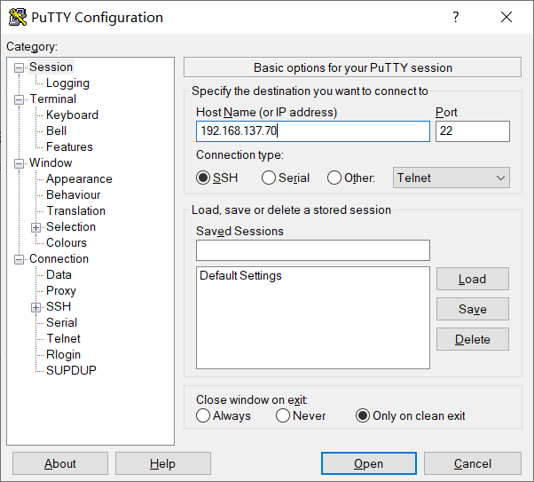

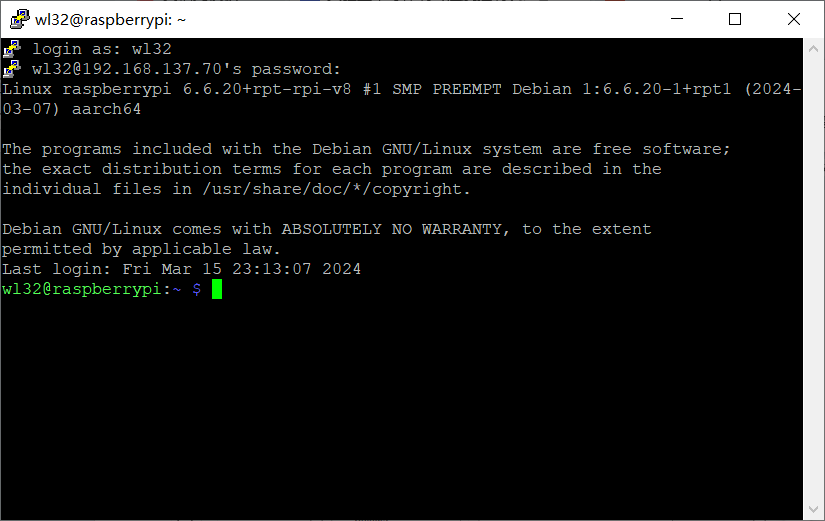

**VNC 连接：**

在树莓派终端下载（如系统自带不用下载）并打开 VNC 服务；在 Windows 端下载 VNC 应用程序，然后打开，搜索 IP，输入用户名密码进行连接。

参考：

- <https://www.labno3.com/2021/08/03/setting-up-a-vnc-server-on-the-raspberry-pi/>
- <https://shumeipai.nxez.com/2018/08/31/raspberry-pi-vnc-viewer-configuration-tutorial.html>

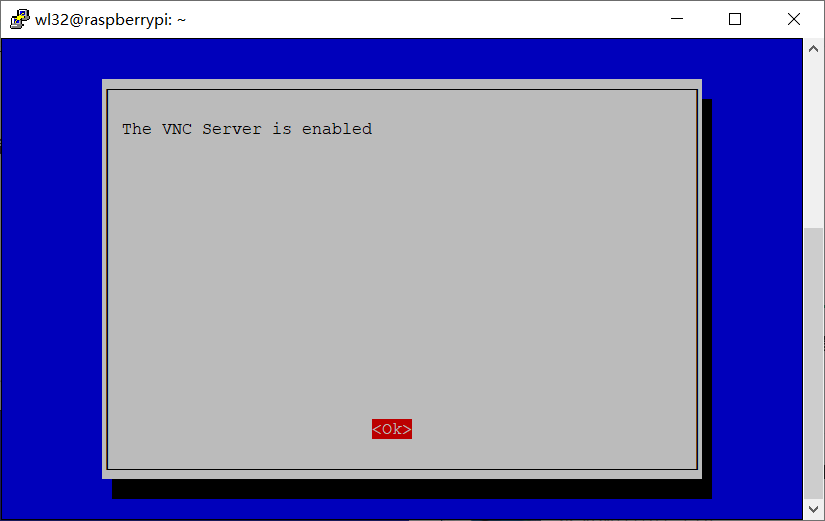

图 1 打开 VNC 服务

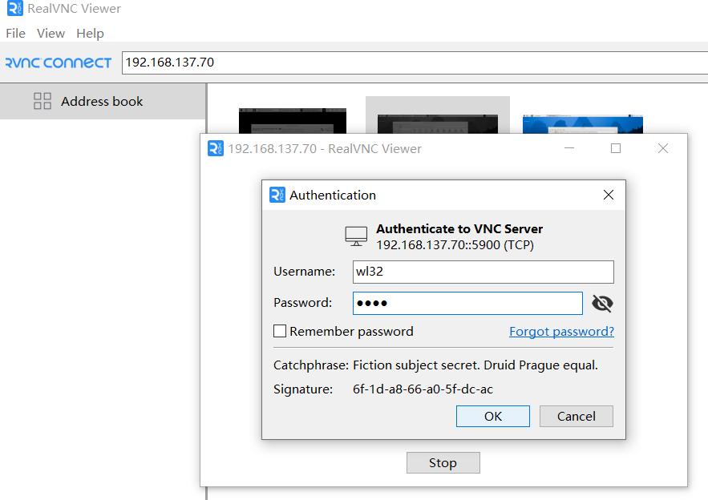

### 3.2 DHT2302 温湿度传感器数据读取

参考：

- <https://pimylifeup.com/raspberry-pi-humidity-sensor-dht22/>
- <https://github.com/adafruit/Adafruit_CircuitPython_DHT>

在树莓派中建立一个新文件夹（示例 dht22），在其中安装虚拟环境 env，虚拟环境中装 adafruit-circuitpython-dht 库（树莓派 4B 该库只能装在虚拟环境里面，不能全局安装）：

```bash
mkdir ~/dht22
cd ~/dht22
python3 -m venv env
source env/bin/activate
python3 -m pip install adafruit-circuitpython-dht
```

然后使用 clone 指令，再在文件夹中克隆 GitHub 上的官方项目。完成后可在 dht22 文件夹下看到 Adafruit_CircuitPython_DHT 文件夹，里面包含测试代码。

```bash
git clone https://github.com/adafruit/Adafruit_CircuitPython_DHT
```

在虚拟环境启动下，打开 Adafruit_CircuitPython_DHT 文件夹下的 dht_simpletest.py 测试程序（传感器接 GPIO，请参考第一个网址。注意按照硬件具体连线确定针脚序号，使用 `sudo nano dht_simpletest.py` 修改 GitHub 项目中的测试程序的代码。如信号线连 GPIO4 pin 则为 **D4**：`dhtDevice = adafruit_dht.DHT22(board.D4)`）。

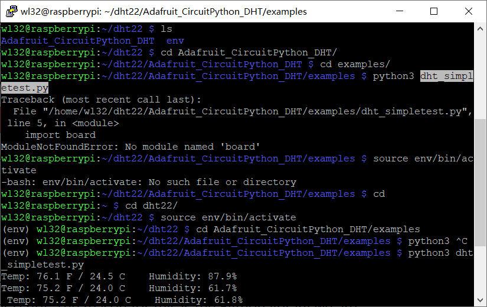

### 3.3 PT100 + MAX31865 测温

MAX31865 焊接连线教程参考链接一，树莓派环境配置参考链接二。

参考：

- <https://learn.adafruit.com/adafruit-max31865-rtd-pt100-amplifier/python-circuitpython>
- <https://github.com/adafruit/Adafruit_CircuitPython_MAX31865>

配置环境，虚拟环境，装 Adafruit_CircuitPython_MAX31865 库，克隆 GitHub 项目：

```bash
mkdir project-name && cd project-name
python3 -m venv .venv
source .venv/bin/activate
pip3 install adafruit-circuitpython-max31865
git clone https://github.com/adafruit/Adafruit_CircuitPython_MAX31865
```

用 `sudo nano max31865_simpletest.py` 指令，修改 max31865_simpletest.py 中针脚、电阻、线等参数；然后用 `sudo raspi-config` 指令进入配置页，打开 SPI 接口（树莓派默认关闭），然后打开 py 程序测试。

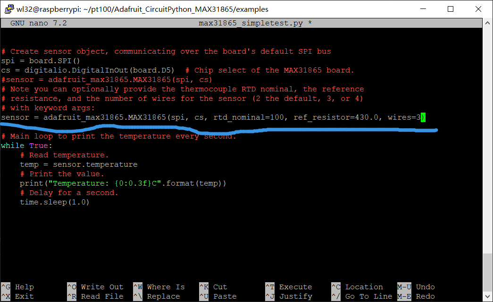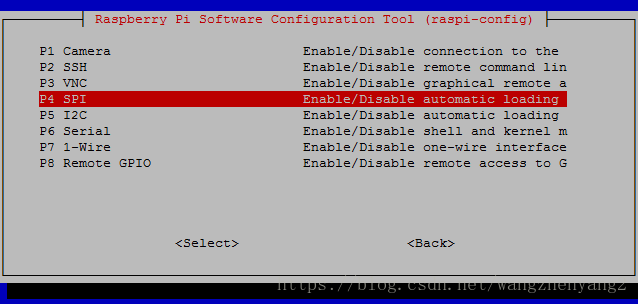

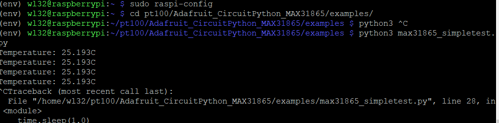

## 4. 测试

### 4.1 高低温测试

初步测试，半导体制冷片可在短时间内实现局部的升温和降温，效果明显。**-15℃ 至 60℃ 范围**是比较容易达到的。

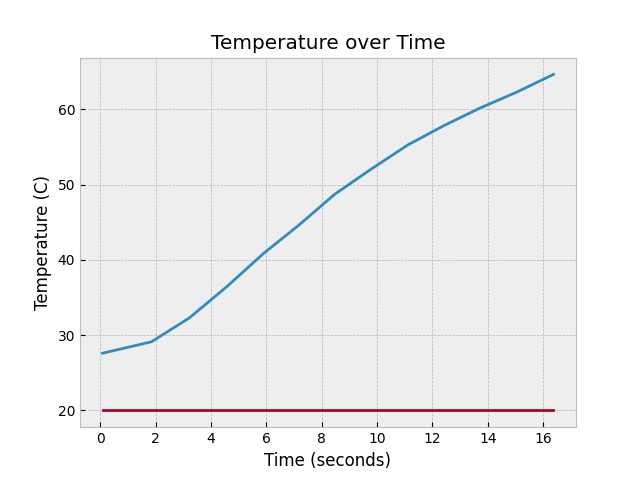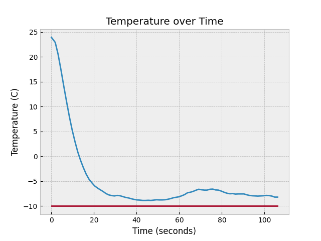

### 4.2 温度调控测试

输入电流调控，根据热平衡原理，当器件散热量等于制冷片输入给器件的热量时，器件温度可维持稳定。

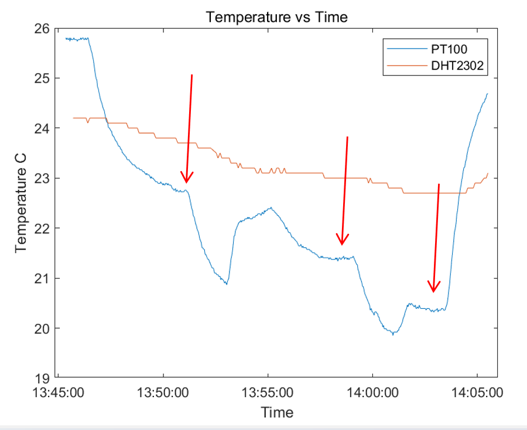

### 4.3 运用继电器进行温度调控

将继电器接入半导体制冷片的电路，用树莓派一边监测 PT100 传感器温度同时，一边控制继电器。可以实现温度在小范围的波动，从而粗略地控制温度。

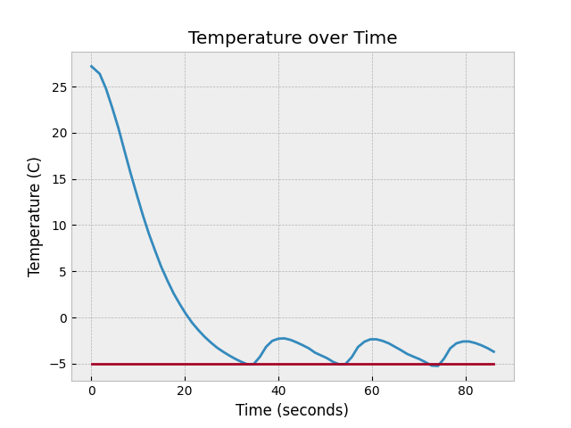

PT100 + 树莓派 4B + 继电器 + 半导体制冷片，温度调控代码示例（完整代码见 [relay_control_temp.py](relay_control_temp.py)）：

```python
import time
import board
import digitalio
import adafruit_max31865
import matplotlib.pyplot as plt
import RPi.GPIO as GPIO
import os

#file = os.open("temperature_data.txt", os.O_CREAT | os.O_TRUNC | os.O_WRONLY)

# Set the GPIO mode (BCM or BOARD)
GPIO.setmode(GPIO.BCM)
# Define the GPIO pin connected to the relay module's IN pin
RELAY_PIN = 12
# Set the relay pin as an output pin
GPIO.setup(RELAY_PIN, GPIO.OUT)

spi = board.SPI()
cs = digitalio.DigitalInOut(board.D5)  # Chip select of the MAX31865 board.
sensor = adafruit_max31865.MAX31865(spi, cs, rtd_nominal=100, ref_resistor=430.0, wires=3)

temperatures = []
times = []
expected_temperatures = []
start_time = time.time()
plt.style.use('bmh')
# 创建一个持续更新的图表
plt.ion()

# 设置预期温度
EXPECTED_TEMP = 24.0
try:
    while True:
        # 读取温度
        temp = sensor.temperature
        #print("Temperature: {0:0.3f}C".format(temp))
        current_time = round(time.time() - start_time, 2)
        # 添加温度和时间到列表
        temperatures.append(temp)
        times.append(current_time)
        # 添加预期温度到它的列表中
        expected_temperatures.append(EXPECTED_TEMP)

        # 绘制图像
        plt.clf()  # 清除之前的图像
        plt.plot(times, temperatures, label='Actual')
        plt.plot(times, expected_temperatures, label='Setpoint')
        plt.title("Temperature over Time")
        plt.xlabel("Time (seconds)")
        plt.ylabel("Temperature (C)")
        plt.draw()  # 更新图像
        # 暂停一下，让图像有更新的时间
        plt.pause(0.1)

        # 如果读取的温度高于预期温度，关闭继电器（GPIO.HIGH）
        if temp > EXPECTED_TEMP:
            GPIO.output(RELAY_PIN, GPIO.HIGH)
            print("Temperature is higher than expected. Relay is now on.")
        # 如果读取的温度低于或等于预期温度，打开继电器 (GPIO.LOW)
        else:
            GPIO.output(RELAY_PIN, GPIO.LOW)
            print("Temperature is equal or lower than expected. Relay is now off.")
        # 每次读取后暂停一秒钟
        time.sleep(1)

except KeyboardInterrupt:
    # 如果用户按下Ctrl+C，就清理GPIO的配置
    GPIO.cleanup()
    # 当程序被用户关闭时，保存图像并退出
    plt.savefig('6.1_1A_tmpmax.png')
    print("Program stopped by user. Final image saved.")
    raise
```

**其他参考代码，可从 GitHub 下载阅览：**

<https://github.com/xyg521/respbarry4b_dht2302_pt100_Temperature_detection>

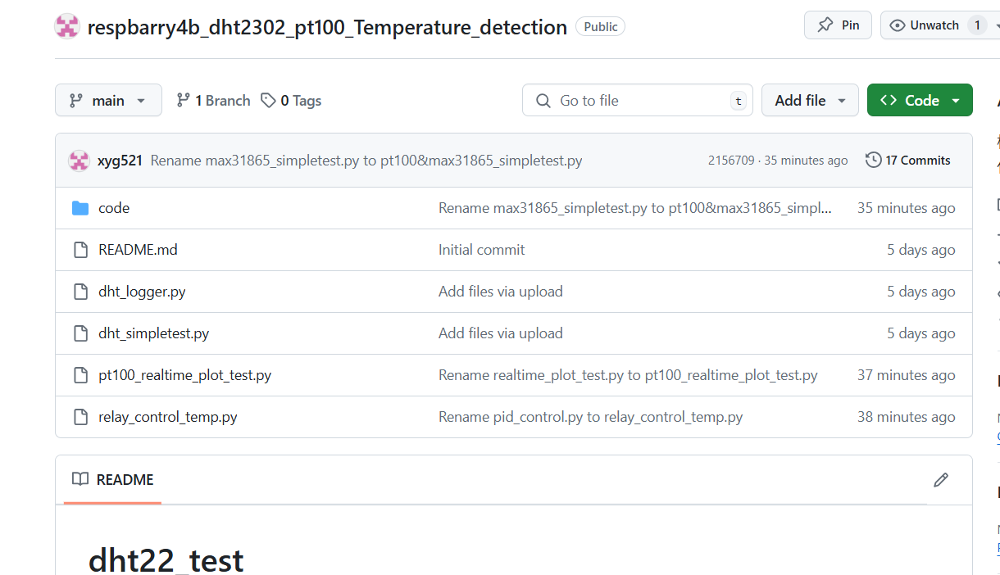

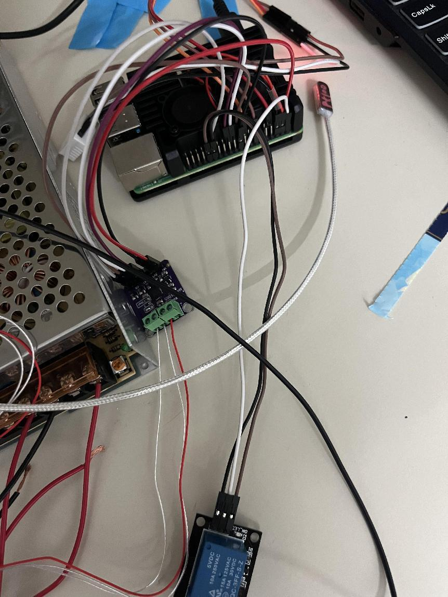
